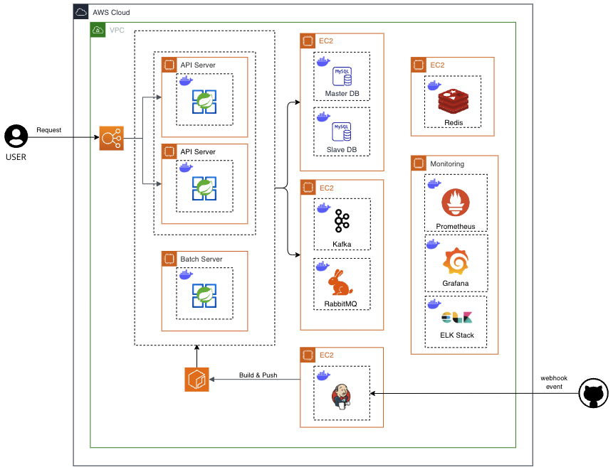
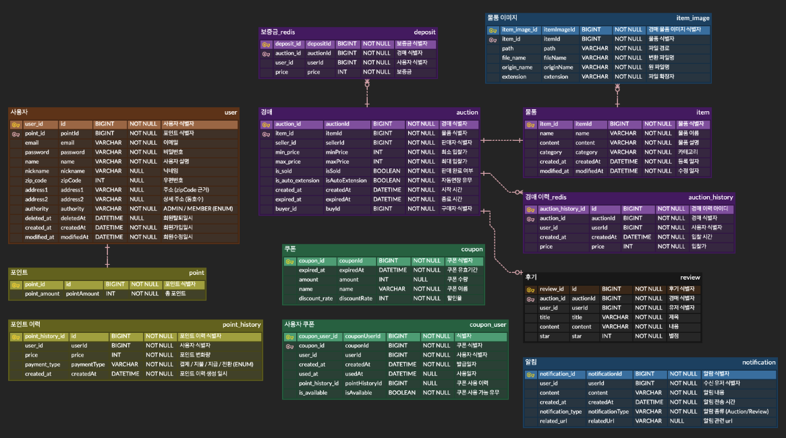
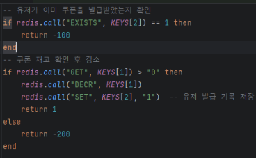
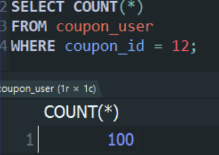

# 📦 중고 물품 실시간 경매 서비스

## 1. 프로젝트 개요
**개발 기간:** 2024.10.21 ~ 2024.11.22

`Auction_999` 는 사용자가 실시간으로 물품을 경매할 수 있는 Java Spring 기반의 중고 경매 사이트입니다. 사용자는 경매 등록, 입찰, 실시간 알림을 통해 다른 사용자와의 경쟁을 경험하며, Toss Pay를 통한 안전한 결제를 제공합니다.

  
<strong>Team Notion</strong>

  
  <a href="https://teamsparta.notion.site/999-1232dc3ef51480e2a3adc7c23fdd3a40">팀 노션</a>

### 서비스 플로우

1. **경매 물품 등록**  
   판매자가 경매에 `물품을 등록` 하여 시작 가격과 경매 만료 시간을 설정합니다.

2. **입찰자 입찰 생성**  
   입찰자는 관심 있는 경매 물품에 `입찰 금액을 입력` 하여 입찰을 시작합니다.

3. **최고 입찰자 갱신**  
   각 입찰 시 기존 최고 입찰 금액과 비교하여 더 높은 금액이 제시되면 해당 입찰자가 `최고 입찰자로 갱신` 됩니다.

4. **경매 종료 및 낙찰**  
   정해진 만료 시간이 지나면 경매가 종료되며, 최고 입찰자가 `최종 낙찰자로 확정` 됩니다.

 

### 아키텍처

  

### ERD

  

 

## 2. 주요 기술 스택

### **백엔드**

     

### **데이터베이스**

   

### **CI/CD**

 

### **클라우드 및 모니터링**

   

### **로그 관리**

  

 

## 3. 팀 소개

  <table>
    <tbody>
      <tr>
        <td align="center" style="padding: 20px;">
          
          

            <b>팀장</b> 
            <a href="https://github.com/devmoonjs" style="font-size: 16px;">문정석</a>
            

              검색 경매 사용자 인프라
            

          

        </td>
        <td align="center" style="padding: 20px;">
          
          

            <b>부팀장</b> 
            <a href="https://github.com/kim-na-ram" style="font-size: 16px;">김나람</a>
            

              경매 모니터링 시스템 쿠폰 만료 처리 배치
            

          

        </td>
        <td align="center" style="padding: 20px;">
          
          

            <b>팀원</b> 
            <a href="https://github.com/areum0116" style="font-size: 16px;">김아름</a>
            

              경매 알림 검색 보증금 환불 배치
            

          

        </td>
        <td align="center" style="padding: 20px;">
          
          

            <b>팀원</b> 
            <a href="https://github.com/inseooo0" style="font-size: 16px;">황인서</a>
            

              결제 쿠폰 경매
            

          

        </td>
      </tr>
    </tbody>
  </table>

 

## 4. 트러블 슈팅 & 최적화 전략

### 1. 입찰 기능 성능 향상 (CQRS 도입)

경매 입찰 로직에서 CQRS 패턴을 도입하여 경매 시스템의 **입찰 기능 성능**을 개선했습니다. 아래는 도입 전후의 성능 테스트 결과입니다.

#### 📊 CQRS 도입 전후 성능 비교
시나리오 상황 : 유저 1000명이 동시에 경매 한 건을 입찰한다.
#### 도입 전 성능 테스트 결과

| 구분      | 표본 수 | 평균 (ms) | 최소값 (ms) | 최대값 (ms) | 표준편차 | 오류 % | 초당 요청 수 | 수신 KB/초 | 전송 KB/초 | 평균 바이트 수 |
|-----------|---------|-----------|-------------|-------------|----------|--------|--------------|------------|------------|---------------|
| HTTP 요청 | 1000    | 8561      | 2506        | 13292       | 3014.49  | 0.20%  | 61.4/sec     | 37.14      | 25.83      | 619.5         |
| **총계**  | **1000**| **8561**  | **2506**    | **13292**   | **3014.49**| **0.20%** | **61.4/sec** | **37.14**  | **25.83**  | **619.5**     |

#### 도입 후 성능 테스트 결과

| 구분      | 표본 수 | 평균 (ms) | 최소값 (ms) | 최대값 (ms) | 표준편차 | 오류 % | 초당 요청 수 | 수신 KB/초 | 전송 KB/초 | 평균 바이트 수 |
|-----------|---------|-----------|-------------|-------------|----------|--------|--------------|------------|------------|---------------|
| HTTP 요청 | 1000    | 4599      | 23          | 8235        | 2076.24  | 0.10%  | 89.0/sec     | 50.92      | 37.44      | 585.6         |
| **총계**  | **1000**| **4599**  | **23**      | **8235**    | **2076.24**| **0.10%** | **89.0/sec** | **50.92**  | **37.44**  | **585.6**     |

#### 💡 성능 개선 요약

- **평균 응답 시간** : 8561ms → 4599ms로 약 `46% 감소`
- **오류율** : 0.20% → 0.10%로 절반 감소
- **처리량 (Throughput)** : 61.4 요청/초 → 89.0 요청/초로 약 `45% 증가`

CQRS 패턴을 통해 **읽기 작업** 과 **쓰기 작업** 을 분리하여, 경매 서비스의 응답 속도와 처리 성능을 크게 개선했습니다. 이를 통해 실시간 경매 환경에서 높은 성능과 안정성을 확보할 수 있었습니다.

 

### 2. 쿠폰 발급 동시성 처리 (분산락 및 Lua 스크립트 적용)

- **Redisson** 을 사용해 **분산락(Distributed Lock)** 을 구현하여 다수의 사용자가 동시에 쿠폰을 발급 요청할 때 발생하는 동시성 문제를 해결했습니다.
- **Lua 스크립트** 를 통해 Redis에 저장된 쿠폰 수량을 원자적으로 조회하고 업데이트하여 동시성을 관리했습니다.
- **쿠폰 발급** 과 같은 추가 작업은 Kafka를 통해 **비동기적으로 처리** 하여 성능을 최적화했습니다.
- **도입 결과** : 여러 사용자가 동시에 쿠폰을 발급받으려 시도하더라도 동시성 제어에 성공하여, 정해진 수량만큼 정확하게 쿠폰이 발급됨을 확인했습니다.

  
  

