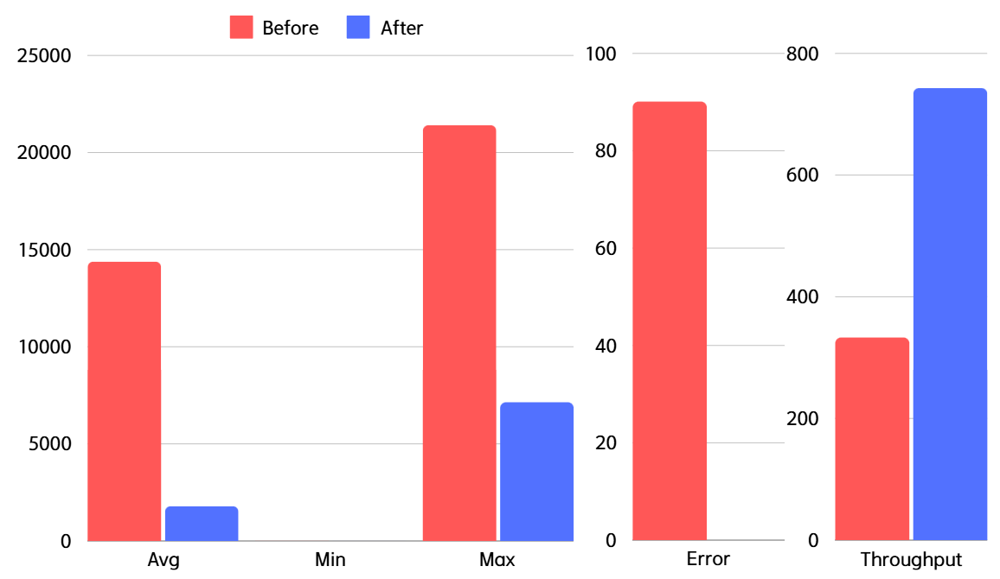
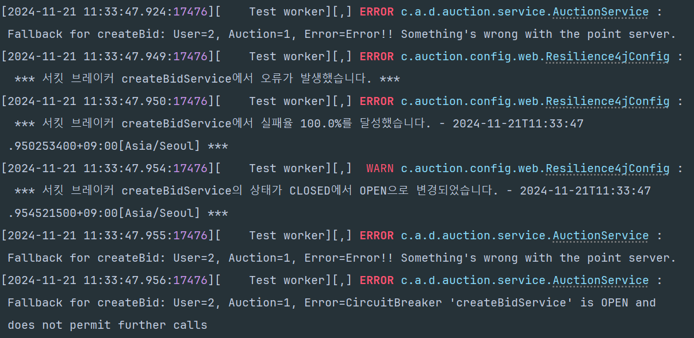

# 📦 중고 물품 실시간 경매 서비스

## 1. 팀원 소개

  <table>
    <tbody>
      <tr>
        <td align="center" style="padding: 20px;">
          
          

            <b>팀장</b> 
            <a href="https://github.com/devmoonjs" style="font-size: 16px;">문정석</a>
            

              검색 경매 초기 인프라 구축 CQRS MSA 전환(gRPC)
            

          

        </td>
        <td align="center" style="padding: 20px;">
          
          

            <b>부팀장</b> 
            <a href="https://github.com/kim-na-ram" style="font-size: 16px;">김나람</a>
            

              경매 모니터링 시스템 쿠폰 만료 처리 배치 배치 서버 CI/CD MSA 전환(OpenFeign)
            

          

        </td>
        <td align="center" style="padding: 20px;">
          
          

            <b>팀원</b> 
            <a href="https://github.com/areum0116" style="font-size: 16px;">김아름</a>
            

              경매 알림 검색 환불 예외 보상 배치 Gateway, Eureka Circuit Breaker
            

          

        </td>
        <td align="center" style="padding: 20px;">
          
          

            <b>팀원</b> 
            <a href="https://github.com/inseooo0" style="font-size: 16px;">황인서</a>
            

              결제 쿠폰 경매 동시성 제어 Terraform CI/CD
            

          

        </td>
      </tr>
    </tbody>
  </table>

## 2. 프로젝트 개요
**개발 기간:** 2024.10.21 ~ 2024.11.22

`All In Auction` 은 사용자가 실시간으로 물품을 경매할 수 있는 Java Spring 기반의 중고 경매 사이트입니다. 사용자는 경매 등록, 입찰, 실시간 알림을 통해 다른 사용자와의 경쟁을 경험할 수 있으며, 대규모 트래픽에도 안정적인 입찰 및 쿠폰 발급이 가능하도록 설계되었습니다.

## 3. 주요 기술 스택

### **애플리케이션**

  

### **인증 및 보안**

  

### **메시징 및 비동기 처리**
   

### **데이터베이스**

   

### **CI/CD**

  

### **클라우드 및 모니터링**

    

### **로그 관리**

  

### **협업 도구**

     

 

## 4. 서비스 플로우

1. **경매 물품 등록**  
   판매자가 경매에 `물품을 등록` 하여 시작 가격과 경매 만료 시간을 설정합니다.

2. **입찰자 입찰 생성**  
   입찰자는 관심 있는 경매 물품에 `입찰 금액을 입력` 하여 입찰을 시작합니다.

3. **최고 입찰자 갱신**  
   각 입찰 시 기존 최고 입찰 금액과 비교하여 더 높은 금액이 제시되면 해당 입찰자가 `최고 입찰자로 갱신` 됩니다.

4. **경매 종료 및 낙찰**  
   정해진 만료 시간이 지나면 경매가 종료되며, 최고 입찰자가 `최종 낙찰자로 확정` 됩니다.

 

### [경매 입찰 로직]

### [쿠폰 로직]

 

## 5. 아키텍처

  

## 6. ERD

  

 

<h2>7. <a href="https://spectacled-plastic-a9d.notion.site/145df15aae15809cb1cad825e0a8364c?pvs=4">기술적 의사결정</a></h2>

## 8. 트러블 슈팅 & 최적화 전략

### 1-1. 입찰 기능 성능 향상 (CQRS 도입)

#### 🔍 문제 원인

- 경매 입찰 로직에서 읽기와 쓰기 작업이 단일 트랜잭션에서 수행되면서 데이터 처리량이 낮고 지연이 발생.
- 높은 동시 요청 시 경합(lock contention)과 데이터베이스 부하 증가.

#### 💡 기술 도입

- **CQRS 패턴**을 도입하여 읽기 작업과 쓰기 작업을 분리.
- 쓰기 작업은 마스터 데이터베이스에 집중하고, 읽기 작업은 읽기 전용 데이터베이스에서 처리.

#### 📈 도입 전후 비교

시나리오: 유저 1000명이 동시에 경매 한 건에 입찰 요청.

**도입 전 성능 테스트 결과**

| 구분      | 표본 수 | 평균 (ms) | 최소값 (ms) | 최대값 (ms) | 표준편차 | 오류 % | 초당 요청 수 | 수신 KB/초 | 전송 KB/초 | 평균 바이트 수 |
|-----------|---------|-----------|-------------|-------------|----------|--------|--------------|------------|------------|---------------|
| HTTP 요청 | 1000    | 8561      | 2506        | 13292       | 3014.49  | 0.20%  | 61.4/sec     | 37.14      | 25.83      | 619.5         |

**도입 후 성능 테스트 결과**

| 구분      | 표본 수 | 평균 (ms) | 최소값 (ms) | 최대값 (ms) | 표준편차 | 오류 % | 초당 요청 수 | 수신 KB/초 | 전송 KB/초 | 평균 바이트 수 |
|-----------|---------|-----------|-------------|-------------|----------|--------|--------------|------------|------------|---------------|
| HTTP 요청 | 1000    | 4599      | 23          | 8235        | 2076.24  | 0.10%  | 89.0/sec     | 50.92      | 37.44      | 585.6         |

#### 🌟 성능 개선 요약

- **평균 응답 시간**: 8561ms → 4599ms (약 `46% 감소`)
- **오류율**: 0.20% → 0.10% (절반 감소)
- **처리량**: 61.4 요청/초 → 89.0 요청/초 (약 `45% 증가`)

 

 

### 1-2. 입찰 기능 성능 향상 (gRPC 도입)

#### 🔍 문제 원인

- 기존 모놀리식 아키텍처에서 OpenFeign을 사용한 서비스 간 통신의 응답 시간이 느림.
- JSON 데이터 직렬화로 인해 데이터 전송에 불필요한 오버헤드 발생.

#### 💡 기술 도입

- **gRPC**를 도입해 Protobuf 기반 데이터 직렬화로 전송 속도 개선.
- OpenFeign에서 gRPC로 전환하여 서비스 간 통신 최적화.

#### 📈 도입 전후 비교

시나리오: 유저 1000명이 동시에 경매 한 건에 입찰 요청.

**OpenFeign 성능 테스트 결과**

| 구분      | 표본 수 | 평균 (ms) | 최소값 (ms) | 최대값 (ms) | 표준편차 | 오류 % | 초당 요청 수 | 수신 KB/초 | 전송 KB/초 | 평균 바이트 수 |
|-----------|---------|-----------|-------------|-------------|----------|--------|--------------|------------|------------|---------------|
| HTTP 요청 | 1000    | 8208      | 79          | 14911       | 3899.81  | 0.00%  | 56.3/sec     | 33.86      | 23.62      | 615.8         |

**gRPC 성능 테스트 결과**

| 구분      | 표본 수 | 평균 (ms) | 최소값 (ms) | 최대값 (ms) | 표준편차 | 오류 % | 초당 요청 수 | 수신 KB/초 | 전송 KB/초 | 평균 바이트 수 |
|-----------|---------|-----------|-------------|-------------|----------|--------|--------------|------------|------------|---------------|
| HTTP 요청 | 1000    | 4428      | 14          | 8169        | 2254.94  | 0.00%  | 89.5/sec     | 51.38      | 37.73      | 585.8         |

#### 🌟 성능 개선 요약

- **평균 응답 시간**: 8208ms → 4428ms (약 `45% 감소`)
- **처리량**: 56.3 요청/초 → 89.5 요청/초 (약 `59% 증가`)

 

 

### 2. 쿠폰 발급 동시성 처리 (Redisson & Lua 스크립트)

#### 🔍 문제 원인

- 여러 사용자가 동시에 쿠폰 발급 요청 시 중복 발급과 데이터 불일치 발생.
- Redis에서 쿠폰 수량을 처리하는 작업이 원자적으로 수행되지 않음.

#### 💡 기술 도입

- **Redisson**으로 분산 락 구현하여 동시성 문제 해결.
- **Lua 스크립트**를 사용해 Redis에서 쿠폰 수량 조회와 업데이트를 원자적으로 처리.

#### 📈 도입 전후 비교

시나리오: 1000개의 수량을 가진 쿠폰에 대해 10000명이 발급 요청

- **도입 전**: 동시 요청으로 인해 데이터 불일치 문제 발생, 요청 실패율 증가.

| 구분      | 표본 수 | 평균 (ms) | 최소값 (ms) | 최대값 (ms) | 표준편차   | 오류 %  | 초당 요청 수 | 수신 KB/초 | 전송 KB/초 | 평균 바이트 수 |
|-----------|---------|-----------|-------------|-------------|------------|---------|--------------|------------|------------|---------------|
| HTTP 요청 | 10000   | 14385     | 13          | 21409       | 6561.68    | 90.01%  | 333.6/sec    | 285.48     | 116.58     | 868.6         |

- **도입 후**: 동시성 제어에 성공하여 정확한 쿠폰 수량 관리, 요청 실패율 0%.

| 구분      | 표본 수 | 평균 (ms) | 최소값 (ms) | 최대값 (ms) | 표준편차   | 오류 %  | 초당 요청 수 | 수신 KB/초 | 전송 KB/초 | 평균 바이트 수 |
|-----------|---------|-----------|-------------|-------------|------------|---------|--------------|------------|------------|---------------|
| HTTP 요청 | 10000   | 1792      | 6           | 7142        | 1980.98    | 0%      | 743.2/sec    | 725.82     | 234.51     | 1000.1        |

#### 🌟 성능 개선 요약

- **동시 요청 처리**: 정확한 쿠폰 발급 수량 유지.
- **성공률 증가**: 동시 요청에서도 발급 성공률 100% 보장.
- **평균 응답 시간**: 14385ms → 1792ms (약 `87.5% 감소`)
- **오류율**: 90.01% → 0% (완전 제거)
- **처리량**: 333.6 요청/초 → 743.2 요청/초 (약 `122.8% 증가`)

 

  
  

 

### 3. 만료된 쿠폰 처리 (스프링 배치)

#### 🔍 문제 원인

- **JPAItemWriter**의 **Dirty Checking**으로 단건 처리 발생하며 빈번한 Database 통신으로 인한 성능 저하.
- Reader에서 모든 컬럼 조회하며 불필요한 데이터 과다 조회.

#### 💡 기술 도입

- Writer를 **JDBCBatchItemWriter**로 변경하여 배치 단위로 데이터 처리.
- Reader에서 필요한 컬럼만 조회하도록 **Projection** 적용하여 **쿼리 최적화**.
- 순서 보장이 불필요한 작업이므로 Single Thread에서 **Multi Thread**로 변경.

#### 📈 도입 전후 비교

- **도입 전**: 만료된 쿠폰 처리 시간 1시간 47분.
- **1차 개선 - Reader, Writer 변경**: 처리 시간 21분으로 단축.
- **2차 개선 - Multi Thread로 변경**: 처리 시간 1분으로 단축.

#### 🌟 성능 개선 요약

- **처리 속도 1차 개선**: 107.44분 → 21.05분 (약 `5.1배 향상`).
- **처리 속도 2차 개선**: 21.05분 → 1.32분 (약 `15.9배 향상`).
- **총 실행 시간 단축**: 107.44분 → 1.32분 (약 `98.77% 단축`).

 

**[Before]**   

**[1차 개선]**   

**[2차 개선]**   

 

<!-- (수정) -->
 

### 4. MSA 전환 후 장애 대응 및 오류 전파 방지 (Circuit Breaker 사용)

#### 🔍 문제 원인

- MSA 환경 전환으로 인해 서비스 간 **의존성이 증가**.
- 하나의 서비스가 장애를 일으키면 이를 호출하는 다른 서비스들도 **무한 대기 상태에 빠지거나 장애가 전파**.
- 장애 서비스로의 요청이 계속 쌓여 CPU, 메모리 등 **리소스가 고갈**되며 전체 성능 저하.
- 실패한 서비스 호출로 인해 응답 시간 늘어나며 사용자 경험 악화.

#### 💡 기술 도입

- **Resilience4J**를 활용해 서비스 연쇄 장애 방지 및 MSA 환경에서의 안정적인 서비스 구축.
- 임계치 초과 시 **호출을 차단(OPEN)** 하고, 문제가 있는 서비스로의 추가 요청 차단.
- **Fallback 메서드**를 통한 서비스 대체 동작 구현 및 서비스의 완전한 장애 방지.

 

**[Before]**    

**[After]**   

 

### 5. 검색 성능 향상 (Elasticsearch 도입)

#### 🔍 문제 원인

- 기존 SQL의 `LIKE %___%` 방식으로 Full Table Scan 발생.
- 검색어와 완전히 일치하지 않으면 결과 반환 불가.

#### 💡 기술 도입

- **Elasticsearch** 도입하여 역 인덱스(Inverted Index) 기반 검색 구현.
- **Nori Analyzer**로 한국어 형태소 분석 및 검색 정확도 향상.
- **Fuzziness** 활성화로 오타 허용 및 부분 일치 검색 가능.

#### 📈 도입 전후 비교

시나리오: 1000명이 300만 건의 상품을 검색.

**도입 전 성능 테스트 결과**

| 구분      | 표본 수 | 평균 (ms) | 최소값 (ms) | 최대값 (ms) | 표준편차 | 오류 % | 초당 요청 수 | 수신 KB/초 | 전송 KB/초 | 평균 바이트 수 |
|-----------|---------|-----------|-------------|-------------|----------|--------|--------------|------------|------------|---------------|
| HTTP 요청 | 1000    | 78241      | 2933       | 154075      | 43697.74  | 10.20%  | 6.4/sec    | 15.82      | 2.52       | 2544.0         |

**도입 후 성능 테스트 결과**

| 구분      | 표본 수 | 평균 (ms) | 최소값 (ms) | 최대값 (ms) | 표준편차 | 오류 % | 초당 요청 수 | 수신 KB/초 | 전송 KB/초 | 평균 바이트 수 |
|-----------|---------|-----------|-------------|-------------|----------|--------|--------------|------------|------------|---------------|
| HTTP 요청 | 1000    | 403       | 6           | 799         | 248.18   | 0.00%  | 340.8/sec    | 743.57     | 137.49     | 2234.0        |

#### 🌟 성능 개선 요약

- **평균 응답 시간**: 78241ms → 403ms (약 `98% 감소`).
- **처리량**: 6.4 요청/초 → 340.8 요청/초 (약 `53배 증가`).

 

 

### 6. 보증금 환불 시 카프카 예외 처리

#### 6-1. 트랜잭션 롤백 처리로 데이터 일관성 확보
- Kafka 프로듀서에 `Transactional ID`를 부여, 메시지 발송과 서비스 단의 데이터베이스 트랜잭션을 **하나의 작업 단위**로 묶음.
- 이를 통해 데이터 손실 및 중복 처리 방지 가능. 메시지의 Exactly Once 전송 보장.

#### 6-2. ACKS_CONFIG 설정으로 메시지 저장 신뢰성 강화
- `acks=all` 옵션을 활성화하여 모든 replication의 broker가 메시지를 정상적으로 저장했음을 확인한 후에만 메시지가 처리되도록 설정.
- 이를 통해 메시지 손실 가능성을 줄이고 **강한 내구성(durability)** 보장.

#### 6-3. CustomErrorHandler와 DLT(Dead Letter Topic) 도입
- 예외로 인한 소비 실패 메시지들의 누락 방지를 위해 **Custom ErrorHandler** 구현, 예외 상황 세부적으로 관리.
- 실패한 메시지를 별도의 **Dead Letter Topic(DLT)** 에 저장하도록 구성하여 이후 관리자나 별도 프로세스를 통해 **문제 추적 및 재처리** 가능하도록 설정.

#### 6-4. 예외 발생 시 관리자 Slack 알림 전송
- **실시간 문제 모니터링**과 **안정성 유지**를 위해 Slack API 연동, 예외 케이스 발생 시 관리자 채널로 알림 발송하도록 설정.

#### 6-5. 적절한 파티션 수 설정으로 처리량 최적화
- Kafka Topic의 파티션 개수를 입찰 요청량과 소비자의 처리 속도에 맞춰 적절히 설정.
- Consumer 인스턴스와 병렬 처리를 고려하여 계산, 이를 통해 **로드 밸런싱**을 극대화하고 메시지 처리 지연을 최소화.

